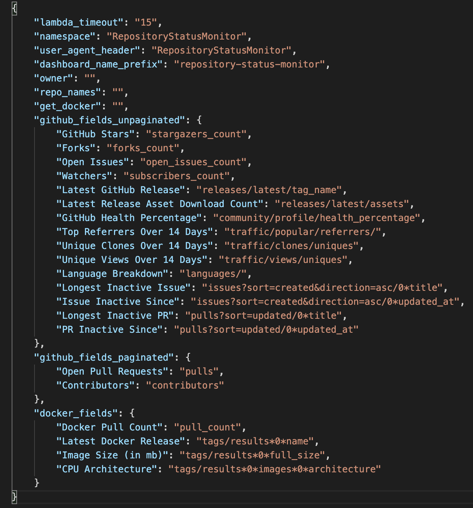
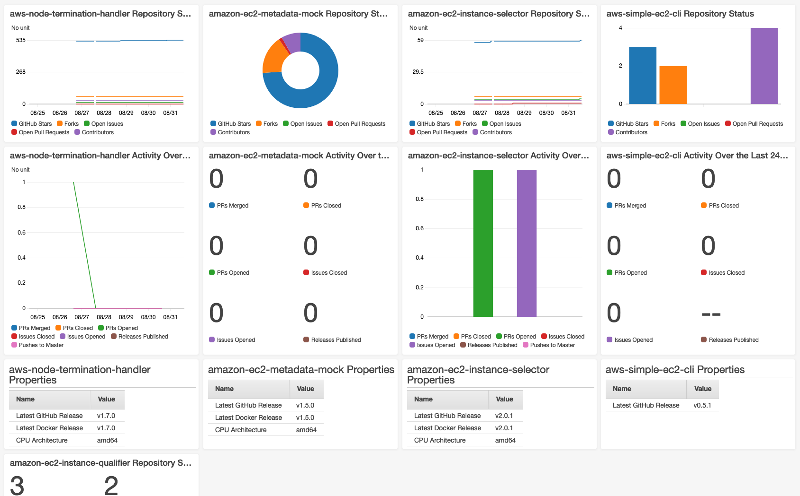
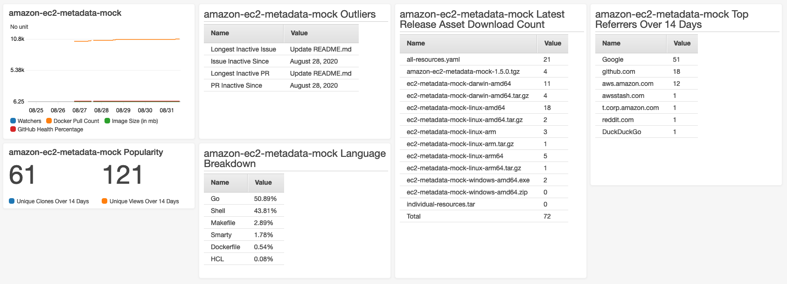
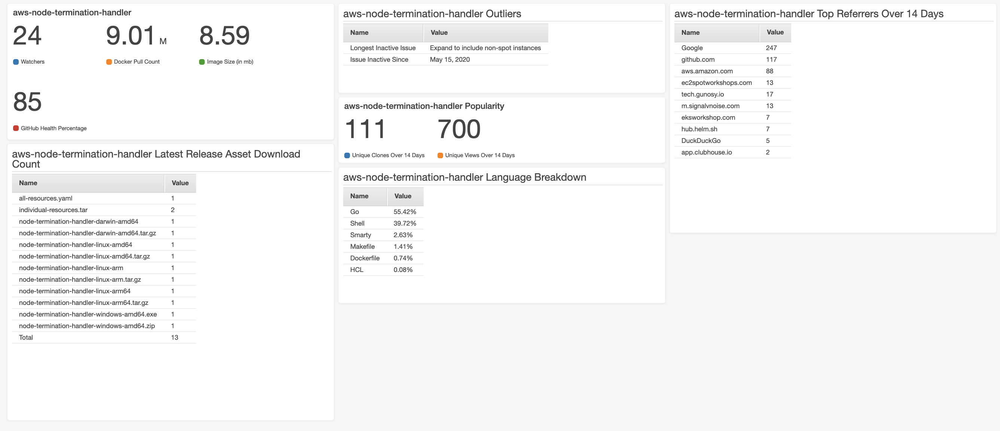

# AWS Repository Status Monitor
> The AWS Repository Status Monitor helps open-source developers keep track of GitHub and Docker metrics for their open source projects. 
An AWS Lambda function, triggered hourly, consolidates the metrics for specified repositories and creates CloudWatch dashboards to display them. 
Actionable metrics for all repositories exist in one centralized dashboard, while details dashboards, one per repository, host the other metrics. 
GitHub webhooks add another layer of complexity to the collected metrics.


## Installing the AWS CDK

Install the AWS Cloud Development Kit:

```sh
$ npm install -g aws-cdk
```

## Setting Up the AWS CLI 

[Install the AWS CLI](https://docs.aws.amazon.com/cli/latest/userguide/cli-chap-install.html)

To configure your AWS credentials for the AWS CLI:
```sh
$ aws configure
```

## Development setup

To install all necessary packages:
```sh
$ python3 -m venv .env
$ source .env/bin/activate
$ pip install -r requirements.txt
```

## Configuring Your App
Before you can launch your dashboard, you'll need to set certain context variables, so the dashboard collects and displays the data you desire. The `configuration` folder contains two config files for these context variables. 

In `environment_config.json`, you can set the account and region into which you would like the app deployed. If the values in this file are left empty, the account and region configured for the AWS CLI will be used.

In `config_variables.json`, you can specify all the context variables (described in detail below). Otherwise, all the context variables contained in this file are set through the launch script. With the exception of GitHub and Docker fields, all of those context variables can also be edited through the launch script. GitHub and Docker fields must be edited in this file.

## Specifying the Context Variables
In the `configuration/config_variables.json` file, these context variables can be manually edited. Alternatively, all except the GitHub and Docker fields can be edited through the launch script.

* Lambda Timeout (`'lambda_timeout'`)
    * the timeout (in seconds) for the metric-handling Lambda function 
    * if your Lambda regulary time out, you must increase this number
    * the max value for this variable is 30 seconds, since it must be lower than the SQS queue timeout
* Namespace (`'namespace'`)
    * the namespace for the metrics in CloudWatch 
* User-Agent Header (`'user_agent_header'`)
    * the User-Agent header to be used for GitHub requests
* Dashboard Name Prefix (`'dashboard_name_prefix'`) 
    * the prefix for all CloudWatch dashboards created by this app
* Owner (`'owner'`)
    * the GitHub owner of the repos whose metrics you would like to collect
    * if this variable is left empty, every repository must have its owner individually specified
        * e.g. `'owner': "", 'repo_names': 'owner/repo_name'`
    * if this variable is not empty, individually specified owners will take precedence
        * e.g. `'owner': "owner", 'repo_names': 'individual_owner/repo_name'`
* Repository Names (`'repo_names'`)
    * the list of repositories for which you would like to collect metrics
    * formatted as comma-separated string without spaces: `'repository-name-1,repository-name-2'`
    * owners for individual repositories are formatted: `'aws/aws-node-termination-handler'` 
* Docker Opt-In (`'get_docker'`)
    * whether to collect metrics from Docker as well as GitHub
    * specify as `'y'` to collect metrics or `'n'` otherwise
* GitHub Fields
    * unpaginated (`github_fields_unpaginated`)
        * any metric that can be retrieved as a single value from some endpoint in the GitHub API
    * paginated (`github_fields_paginated`)
        * the fields that don't exist in the standard metrics returned by GitHub and whose data needs to be manually counted
* Docker Fields (`docker_fields`)
    * the Docker API fields to collect metrics from


Fields are formatted: `'Display Name': 'api_param'`.

Nested fields are formatted: `'Display Name,param1*param2*param3'`.

The base url for GitHub is `'https://api.github.com/repos/:owner/:repo` and for Docker is `'https://hub.docker.com/v2/repositories/amazon/'`. Metrics from any other endpoint should be specified in the format: `'Display Name': 'url_ending/param1*param2'`.

Here is an example of the `configuration/config_variables.json` file:


## Creating the GitHub Personal Authentication Token
This token permits remote access to the GitHub API. Follow the steps below to create your personal authentication token. The GitHub token is another context variable (`'github_token'`) but must not be specified in either `cdk.json` or `config_variables.json` due to security reasons. 

* To create the token:
    * [See GitHub documentation on authorization](https://developer.github.com/v3/auth/#via-oauth-and-personal-access-tokens)
    * create your token by clicking on your icon in the top right corner -> Settings -> Developer settings -> Personal access tokens
    * make sure to give the token read permissions on the repository and user

## Creating and Deploying Your App

To launch your app:
```sh
$ ./launch.py
```

This will confirm that all the context variables are correct, create or update a secret in AWS Secrets Manager with the GitHub token, synthesize the template, and deploy the stack. Using CDK commands (e.g. cdk synth, cdk deploy) to accomplish this is not recommended because of the formatting requirements for context variables. 

If the launch script has been run once, context variables will be saved, and the launch script can be run again non-interactively. This command disables interactive mode:
```sh
$ ./launch.py --d
```


## Usage Example

For two repositories with the default metrics collected, these pictures show examples of the main and details dashboard.

### Main Dashboard:


### Details Dashboards:

